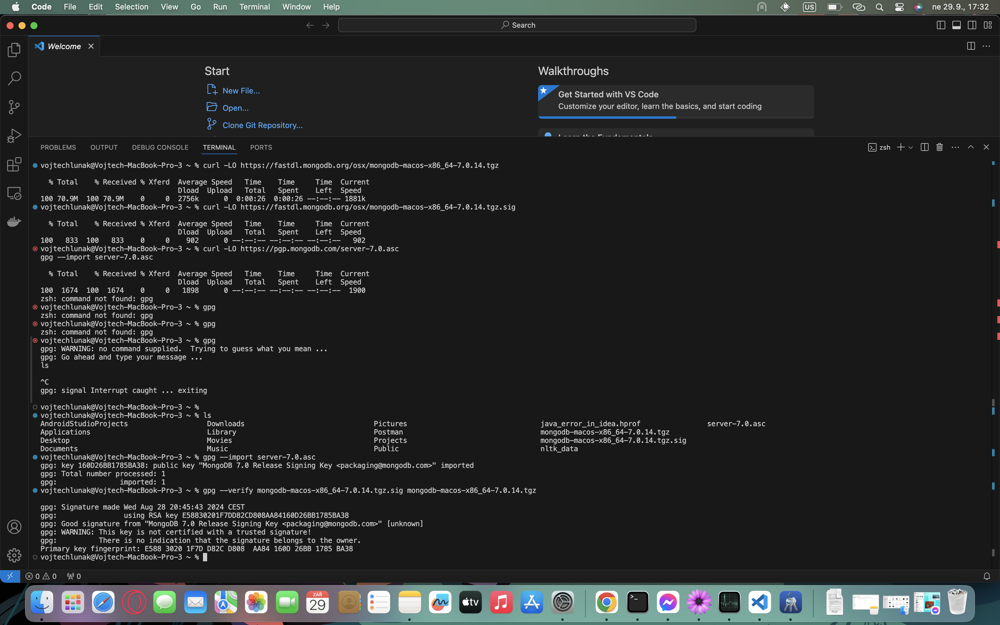
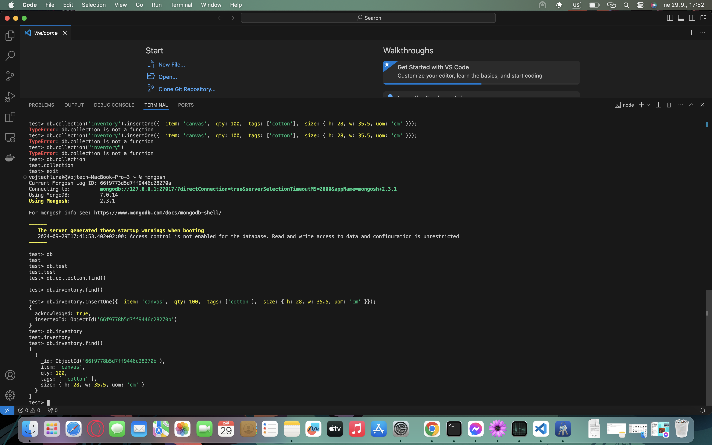
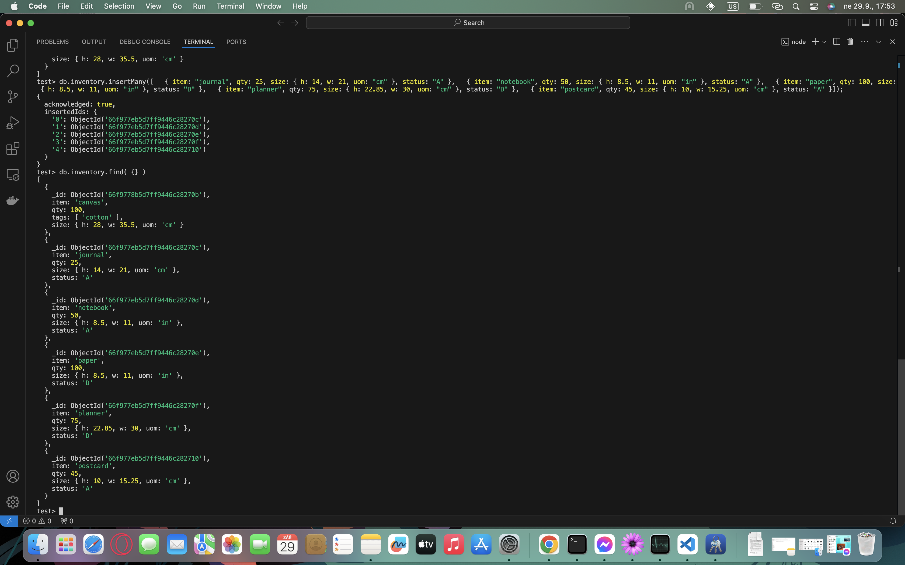
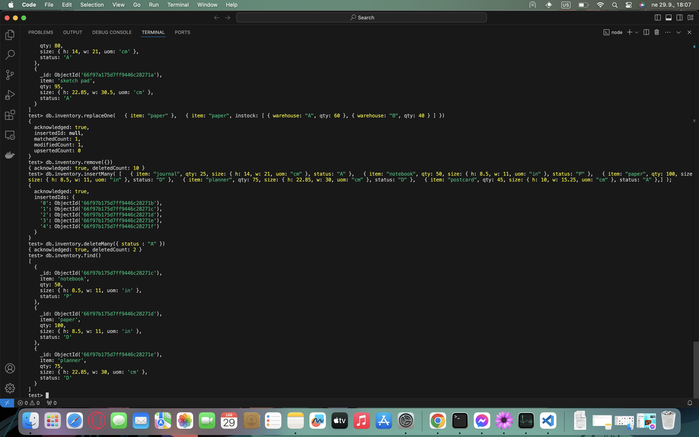
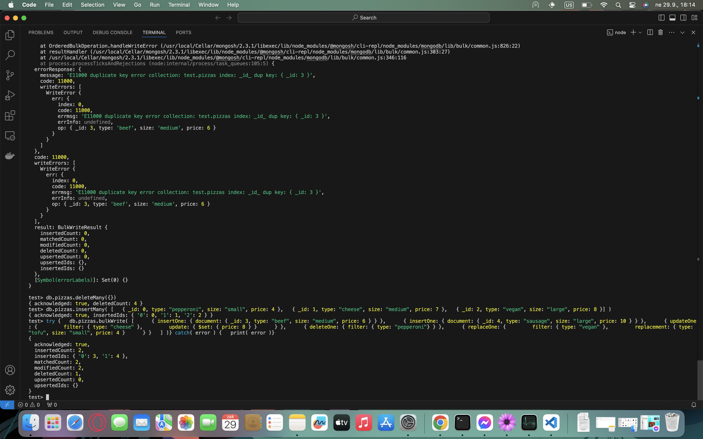
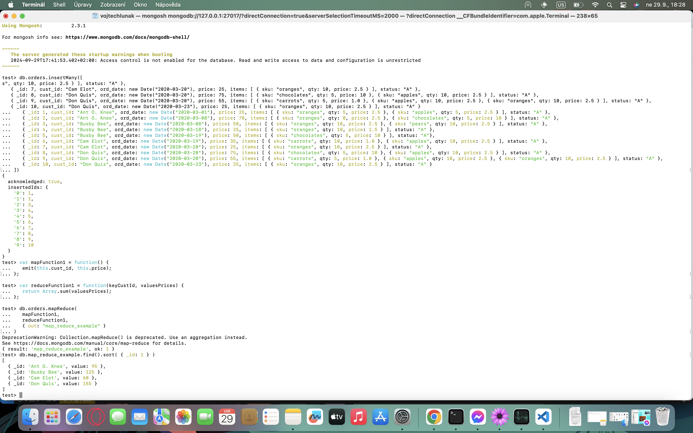
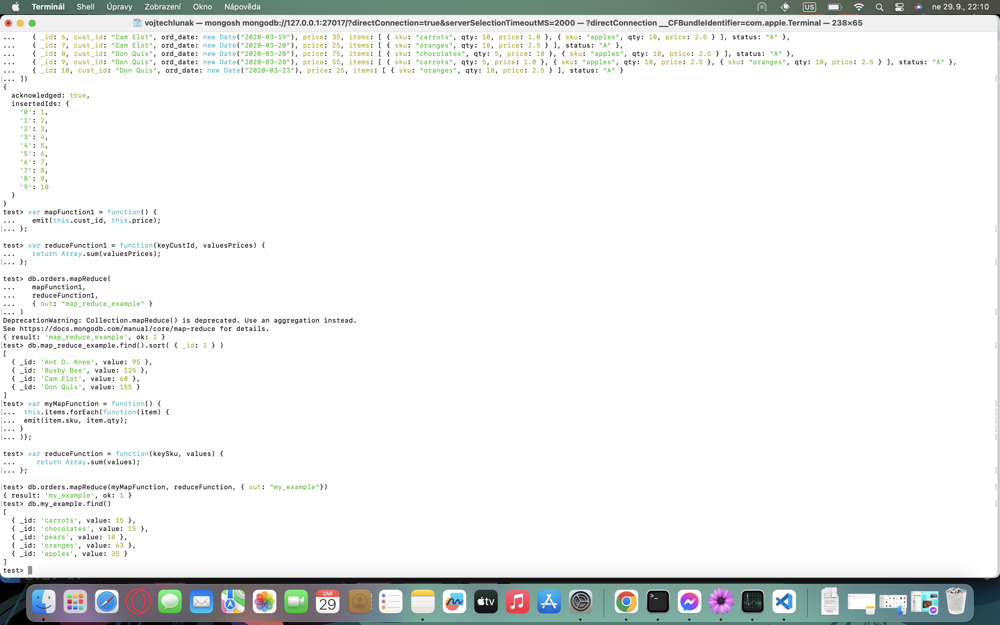

# Lab05

## Technical Problems Encountered

During the installation and setup of MongoDB, no technical problems were encountered. The installation process was straightforward and the setup of the database was done without any issues.

## Screenshots

### Package verification

### CRUD

#### Create and Read

#### Update and Delete

### Bulk write operations

### MapReduce Example

### My MapReduce Example

